# LIS PLAYER 1.0

  

  <strong>Проигрыватель.</strong> 
  Фото, видео, звук и документы с вашего диска — в одном окне.

  

  <a href="#окно-просмотра">Обзор</a>
  ·
  <a href="#полная-инструкция">Инструкция</a>
  ·
  <a href="https://github.com/lis-creative-suite/lis-1.0.n">LIS PLAYER 1.0.N</a>

Это первая публичная линейка **1.0**. Рядом — отдельное издание [1.0.N](https://github.com/lis-creative-suite/lis-1.0.n) (N — нейро). Два установщика, два ярлыка. Этот файл нейро не включает.

---

## Скачать

Текущий выпуск: **1.0**.

Если программа уже установлена, установщик предлагает **обновить** на месте или **полную замену**. Пути к медиатеке и файлы на диске сохраняются. Тема, окно, топор и клавиши сбрасываются к стандартным — это написано в окне перед продолжением.

Файл с GitHub Windows может пометить как скачанный из интернета. Если появится «Windows защитила компьютер» — «Подробнее», затем «Выполнить в любом случае».

---

## Назначение

LIS PLAYER открывает фото, видео, звук и документы в одном окне. Файлы остаются на диске: программа не является облачным сервисом и не подменяет проводник браузером. Каталог библиотеки и правила работы с диском задаёте вы.

## Окно просмотра

При открытии файла программа показывает стандартное окно: шапка, сцена и панель транспорта. Пока файл не выбран, на сцене отображается знак LIS.

  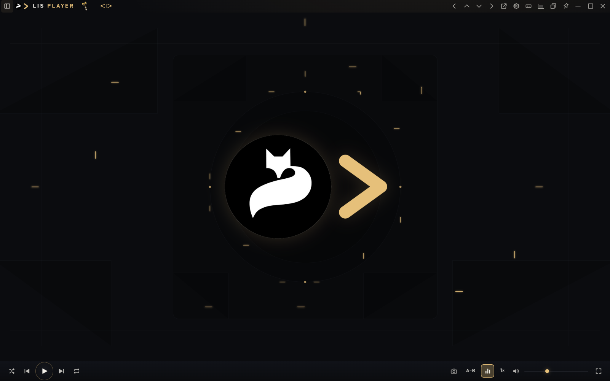

Плейлист не открывается сам. Он вызывается кнопкой в левой части шапки. После этого очередь, поиск и фильтры входят в то же окно. Панель можно закрепить или вынести в отдельное окно.

  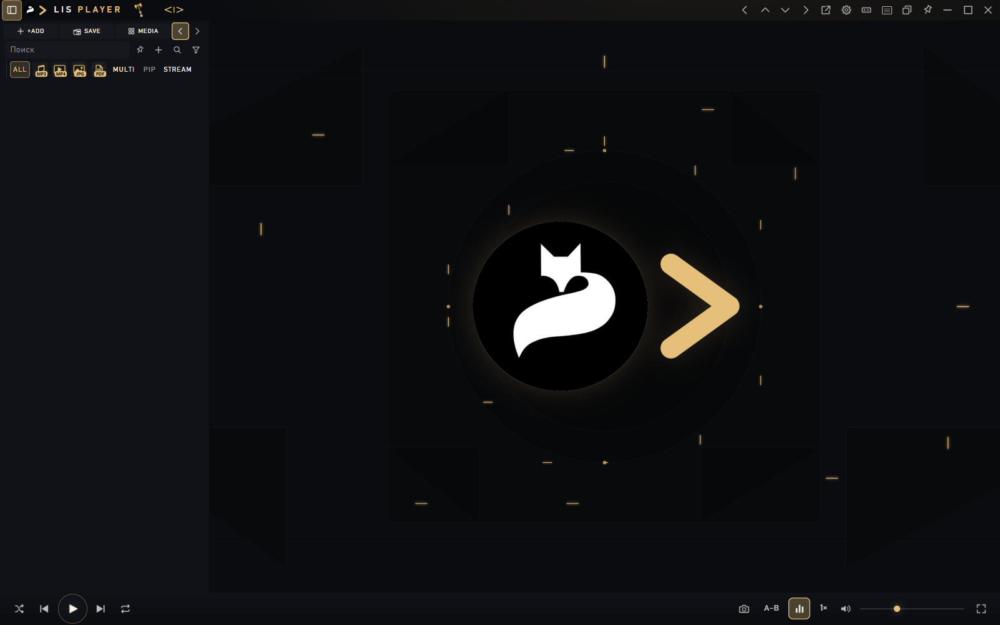

## Библиотека

Кнопка Media открывает каталог. Сначала полки: Audio, Video, Images, Documents — и альбомы внутри. Это папка List Player Library на диске: сюда помещают файлы, которые должны быть рядом с проигрывателем.

  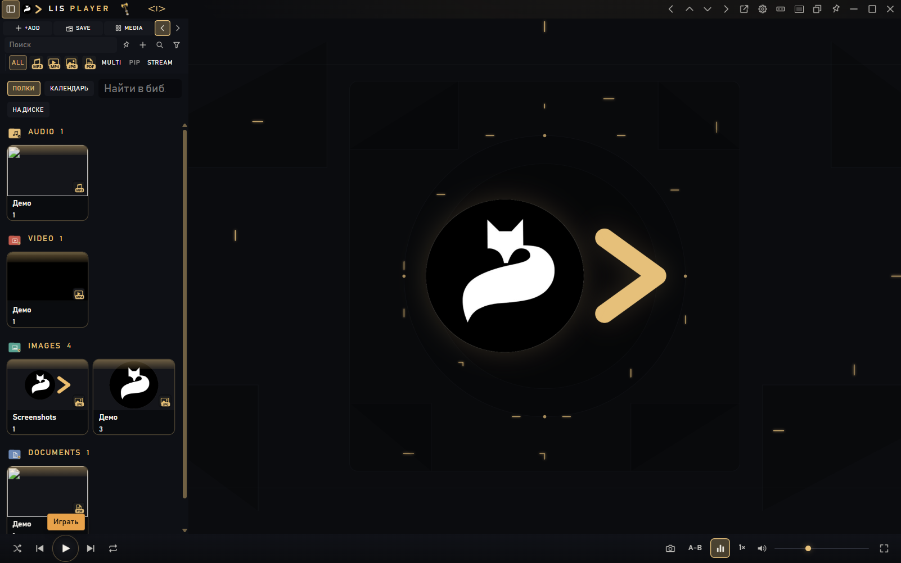

Тот же каталог можно смотреть календарём — по месяцам съёмки или записи.

  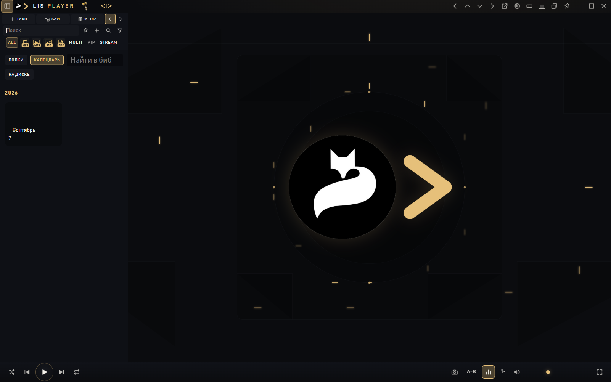

Вложенные папки открываются по альбомам, крошки пути остаются сверху. Удержание карточки полторы секунды включает выделение: копирование, перемещение или удаление нескольких файлов.

  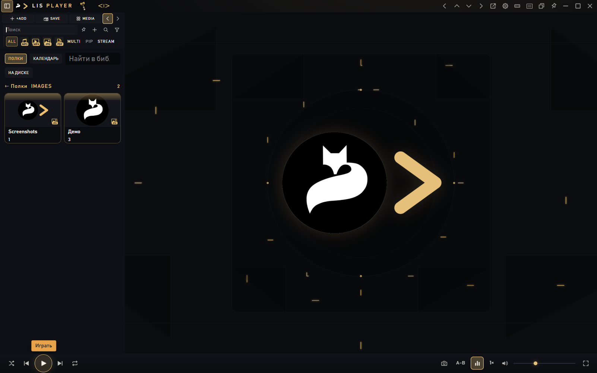

Топор задаёт, изменяет ли программа файлы на диске. Короткий щелчок лист не открывает: его нужно удерживать две секунды. Оранжевый снимает только строку из списка. Красный отправляет файл в корзину. Зелёный копирует в библиотеку и не трогает исходник снаружи.

  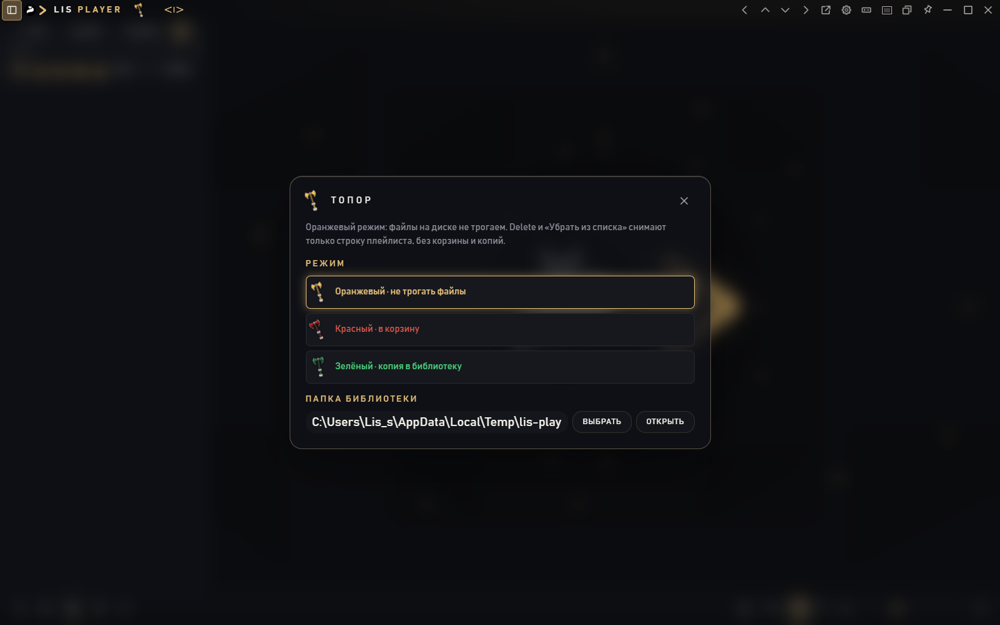

## Режимы окна

На фото скрыты громкость и эквалайзер; доступны посадка кадра, слайдшоу, кисть и лента эскизов. Края сцены листают кадры.

  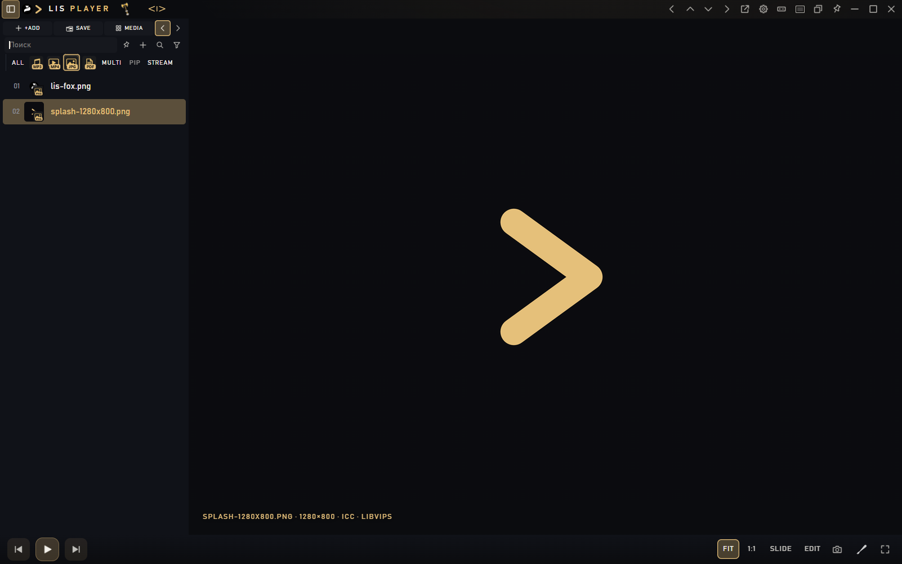

Видео: кадр, перемотка с превью, яркость, скорость, точки A–B. Одиночный щелчок ставит воспроизведение на паузу. Двойной щелчок по зрителю открывает кинозал, а не плейлист.

  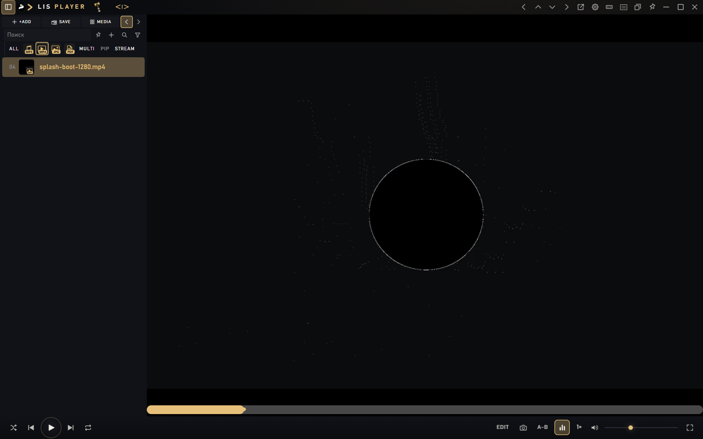

Аудио показывает обложку в центре и полную звуковую панель. При примагничивании к верхнему или нижнему краю раскладка становится полосой.

  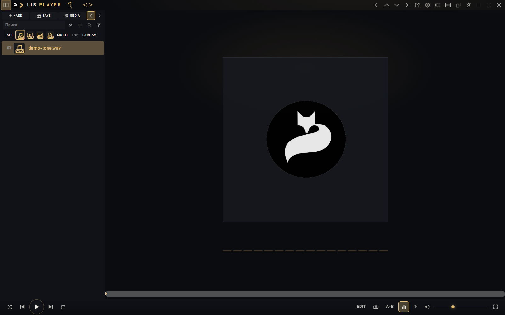

Документ читается в том же окне: текст, страницы, масштаб, кисть. История сессий показывает стрелки, если есть куда вернуться.

  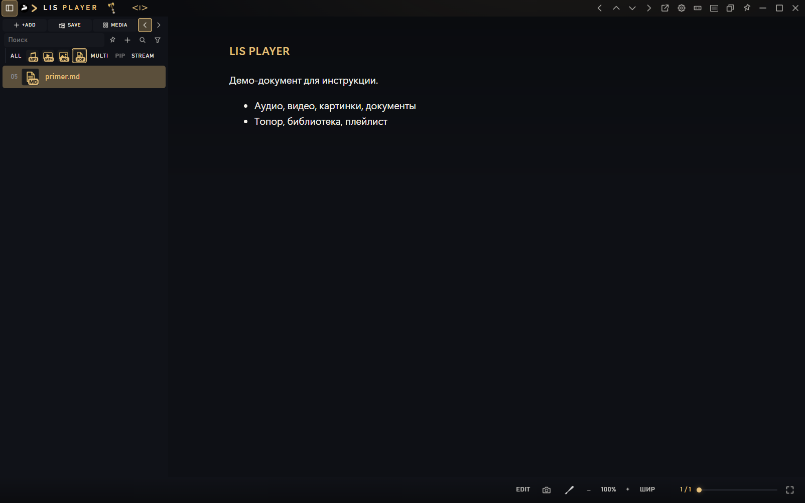

Компакт — узкая полоса, когда окно должно оставаться рядом, а не занимать весь стол. Двойной щелчок по шапке включает его; двойной щелчок по сцене возвращает обычный размер.

  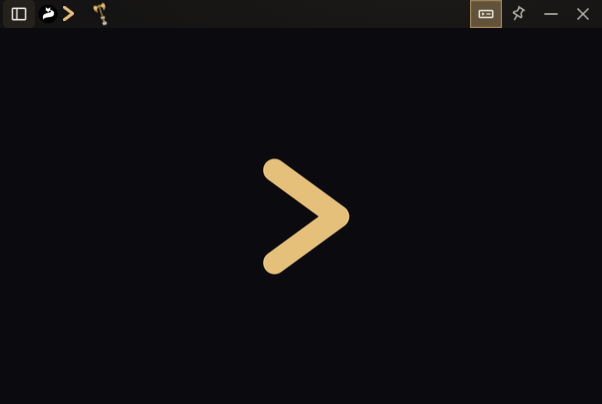

Режим «Без рамки» отдаёт сцену целиком. Шапка появляется, когда курсор у верхнего края. На видео внизу остаётся полоса перемотки: она проявляется при наведении.

  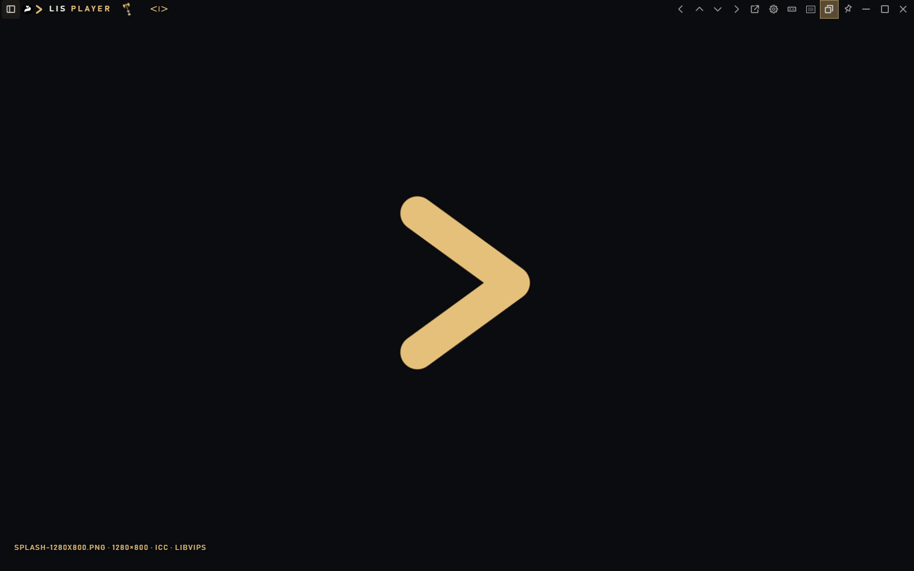

Стрелки в шапке примагничивают окно к краю экрана: тонкая полоса снизу, слева, справа или сверху. Пока магнит включён, кнопка закрытия чаще сворачивает окно к краю, чем завершает программу.

  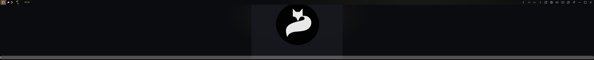

Кинозал — отдельный полный экран для видео и фото. Плейлист при этом скрыт.

  

## Настройки

Темы: Fox, Cinema, Night, Snow, Mist. По умолчанию Mist. В блоке «Окно и плейлист» задаётся **анимация открытия**: Выкл, Тихая, Обычная, Яркая. Она относится только к моменту, когда файл открывается в окно. Перелистывание стрелками, колесом и лентой выполняется сразу, без эффекта.

  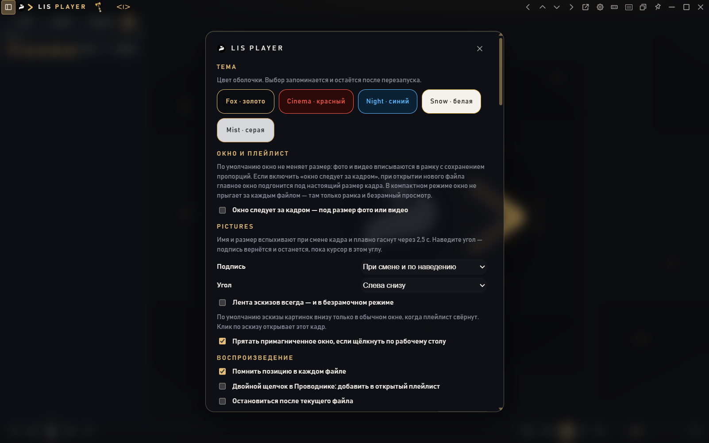

---

## Полная инструкция

Открыть по шагам: установка, шапка, список, топор, библиотека, клавиши

 

Полный текст со всеми снимками: [инструкция LIS PLAYER 1.0](docs/ИНСТРУКЦИЯ.md)

- [Назначение](docs/ИНСТРУКЦИЯ.md#назначение)
- [Установка](docs/ИНСТРУКЦИЯ.md#установка)
- [Окно просмотра](docs/ИНСТРУКЦИЯ.md#окно-просмотра)
- [Верхняя панель](docs/ИНСТРУКЦИЯ.md#верхняя-панель)
- [Плейлист](docs/ИНСТРУКЦИЯ.md#плейлист)
- [Сцена и транспорт](docs/ИНСТРУКЦИЯ.md#сцена-и-транспорт)
- [Картинки: FIT, SLIDE, кисть](docs/ИНСТРУКЦИЯ.md#картинки-fit-slide-кисть)
- [EDIT и редакторы](docs/ИНСТРУКЦИЯ.md#edit-и-редакторы)
- [Просмотр файлов](docs/ИНСТРУКЦИЯ.md#просмотр-файлов)
- [Работа с файлами](docs/ИНСТРУКЦИЯ.md#работа-с-файлами)
- [Библиотека](docs/ИНСТРУКЦИЯ.md#библиотека)
- [Режимы окна](docs/ИНСТРУКЦИЯ.md#режимы-окна)
- [Настройки](docs/ИНСТРУКЦИЯ.md#настройки)
- [Клавиатура](docs/ИНСТРУКЦИЯ.md#клавиатура)

