# LIS PLAYER 1.0 — инструкция

Локальный проигрыватель для Windows: аудио, видео, картинки и документы. Файлы остаются на вашем диске.

Установщик и обзор — на [главной странице LIS PLAYER 1.0](../README.md).

Рядом выходит отдельное издание [LIS PLAYER 1.0.N](https://github.com/lis-creative-suite/lis-player-1.0.n) — та же основа, с нейро. Его ставят отдельно; этот проигрыватель оно не заменяет.

---

## Оглавление

- [Назначение](#назначение)
- [Установка](#установка)
- [Окно просмотра](#окно-просмотра)
- [Верхняя панель](#верхняя-панель)
- [Плейлист](#плейлист)
- [Сцена и транспорт](#сцена-и-транспорт)
- [Картинки: FIT, SLIDE, кисть](#картинки-fit-slide-кисть)
- [EDIT и редакторы](#edit-и-редакторы)
- [Просмотр файлов](#просмотр-файлов)
- [Работа с файлами](#работа-с-файлами)
- [Библиотека](#библиотека)
- [Режимы окна](#режимы-окна)
- [Настройки](#настройки)
- [Клавиатура](#клавиатура)

---

## Назначение

LIS PLAYER открывает локальные файлы в одном окне: шапка, сцена, транспорт и при необходимости плейлист. Медиатека хранится в папке **List Player Library** на диске.

---

## Установка

1. Скачайте установщик с [главной страницы LIS PLAYER 1.0](../README.md). Не берите файл 1.0.N — это другое издание.
2. Файл с GitHub Windows часто помечает как скачанный из интернета. Может появиться синее или жёлтое окно «Windows защитила компьютер» — тогда «Подробнее» и «Выполнить в любом случае». Это защита Windows, а не ошибка установщика; без купленного сертификата издателя это окно не исчезает.
3. Для текущего пользователя программа ставится в папку программ пользователя, без запроса «разрешить внести изменения». Если раньше ставили для всех в Program Files, установщик обновит ту же копию — и Windows отдельно спросит разрешение на изменения компьютера.
4. Если LIS PLAYER уже установлен, появится выбор:
   - **Обновить** — файлы программы заменяются на месте, без снятия установки целиком.
   - **Полная замена** — прежняя программа удаляется, затем ставится эта версия.
5. Перед продолжением установщик показывает предупреждение: настройки сбрасываются на значения новой версии (тема, окно, анимация открытия, топор, клавиши и остальной интерфейс). Пути к библиотеке сохраняются в обоих режимах. Файлы медиатеки на диске не удаляются. Дальше можно идти только после подтверждения.
6. При первой установке можно указать папку библиотеки. При обновлении и полной замене ранее заданные пути к библиотеке и снимкам сохраняются.
7. Ярлыки появятся на рабочем столе и в меню Пуск.
8. Назначьте ассоциации в Настройки → Formats → «Назначить ассоциации», при необходимости «Список Windows».

---

## Окно просмотра

LIS PLAYER — окно с собственной шапкой, без системной рамки. «Классика», «компакт» и «без рамки» — это разные виды **одного** окна, а не разные программы.

| Режим | Как включить | Что видно |
|---|---|---|
| **Классический** | кнопка компакта и «Без рамки» выключены | шапка, сцена, нижняя панель, при желании плейлист |
| **Плейлист открыт** | кнопка списка **слева сверху** | боковая панель со списком |
| **Компактный** | кнопка компакта или **двойной щелчок по шапке** | узкое окно: плейлист, мини/макс и часть кнопок скрыты |
| **Без рамки** | кнопка «Без рамки» | кадр на весь клиент; шапка появляется при наведении вверх; у видео снизу — полоса перемотки |
| **Примагниченный** | стрелки в шапке | узкая полоса у края экрана |
| **Кинозал** | двойной щелчок по кадру видео/фото, кнопка полного экрана или `F` | отдельное полноэкранное окно, **не** плейлист |
| **Откреплённый плейлист** | кнопка «открыть снаружи» | список в своём окне `LIS LIST` |

### Классический режим

Пустой старт: лиса LIS, золотой шеврон, нижний транспорт.

*Классическое окно без открытого файла. Слева в шапке — кнопка плейлиста, лиса, топор и история. Справа — примагничивание, настройки, компакт, посадка кадра, рамка, булавка, свернуть / развернуть / закрыть.*

### Плейлист слева

*Плейлист открывается **только** кнопкой в левом углу шапки (иконка боковой панели). Другие жесты окно не прячут и не раскрывают список.*

### Компактный режим

*Кнопка с иконкой мини-плеера. Воспроизведение ставится на паузу при входе и выходе. Остаются: плейлист (левый угол), топор, булавка, свернуть, закрыть. Двойной щелчок по сцене в компакте возвращает обычный размер. Двойной щелчок по шапке в классике тоже включает компакт.*

### Без рамки

*Кнопка «Без рамки» (восстановить/рамка). Плейлист прячется. Шапка прозрачная и проявляется, когда курсор вверху (`is-chrome`). Нижняя панель транспорта скрыта.*

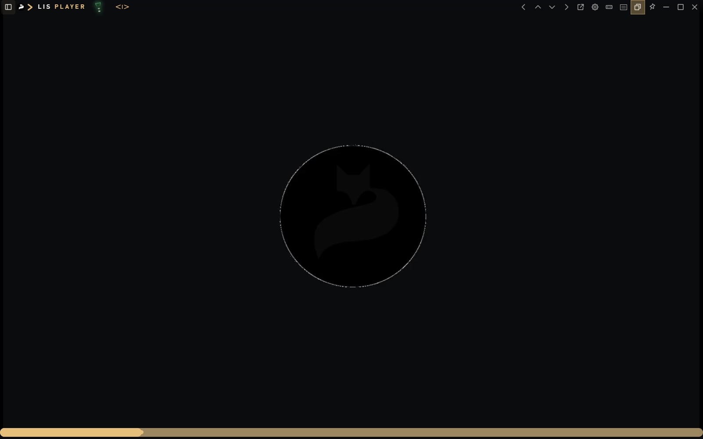

*На видео в безрамном режиме снизу живёт только полоса перемотки: она почти невидима, пока курсор не у нижнего края. Наведите — появится золотая дорожка. Кнопки play / громкость / EQ здесь не рисуются.*

---

## Верхняя панель

Слева направо.

### Кнопка плейлиста (левый угол)

- **Заголовок:** «Плейлист».
- **Клик:** показать или спрятать боковую панель.
- Если плейлист **закреплён** булавкой в панели списка, автоматические попытки свернуть его (безрамный режим, кинозал, смена раскладки) **не срабатывают**. Закрыть тогда можно только этой же кнопкой (`manual: true`).
- Если список откреплён в отдельное окно и булавка выключена, та же кнопка возвращает его обратно.

### Логотип LIS PLAYER

Слово **PLAYER** можно **удержать 3 секунды** — тогда стрелки истории сессий видны до закрытия плеера (если они не включены навсегда в настройках).

Если есть более новая версия, рядом с лисой появляется маленькая красная точка. Нажмите её — откроются **Обновить** и **Пропустить эту версию**. После выбора точка исчезает до следующей версии.

### Топор

Иконка топора рядом с названием. **Короткий клик ничего не открывает** — всплывает «Удерживайте 2 секунды». Удержите **2 с** — лист «ТОПОР». Цвет топора — текущий режим работы с файлами на диске. Подробно в разделе [Работа с файлами](#работа-с-файлами).

### История сессий (лук со стрелками)

По умолчанию скрыта. Появляется, если включить «Всегда показывать стрелку отката», удержать PLAYER 3 с, либо открыт **документ** и уже есть откат.

- **Назад** (`Alt+←`) — предыдущая сессия: файл, позиция, масштаб, пауза.
- **Вперёд** (`Alt+→`) — следующая.
- Клик по средней метке открывает меню откатов с именами файлов и временем.
- Escape запоминает сессию. Случайно открыли другой файл — откат вернёт прошлое место.
- Удалённые файлы остаются **серыми** в той сессии и не перестраивают список; правый щелчок → «Восстановить из корзины».

### Примагнитить влево / вверх / вниз / вправо

Четыре шеврона. Повторный клик по **той же** стороне снимает магнит. Левый/правый магнит одновременно ставит плейлист к этому краю. Пока окно примагничено, крестик и Esc **сворачивают к краю** (не выходят из программы), если не выбран выход из клона. Булавка в шапке в этом режиме значит «не прятать при щелчке по рабочему столу».

*Примагничивание вниз — тонкая полоса.*

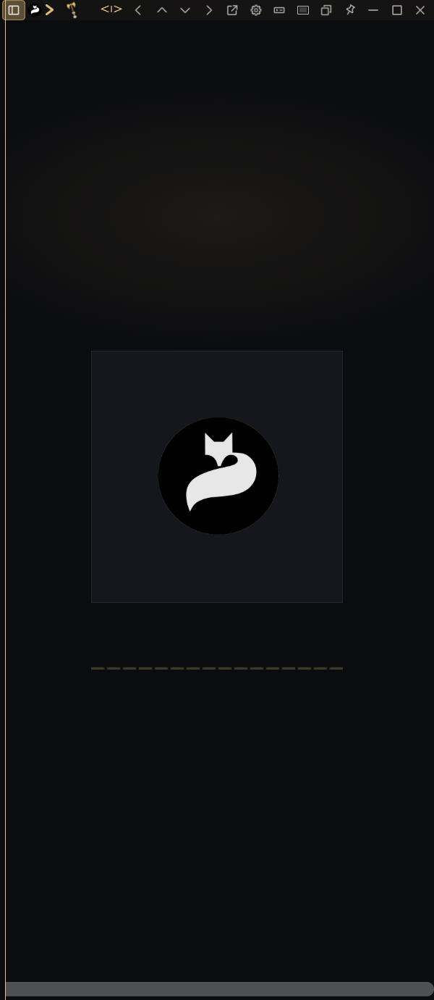

*Примагничивание влево.*

### Открепить плейлист

Иконка «открыть снаружи». Список уезжает в окно **LIS LIST** со своими стрелками края и крестиком. Главное окно остаётся проигрывателем.

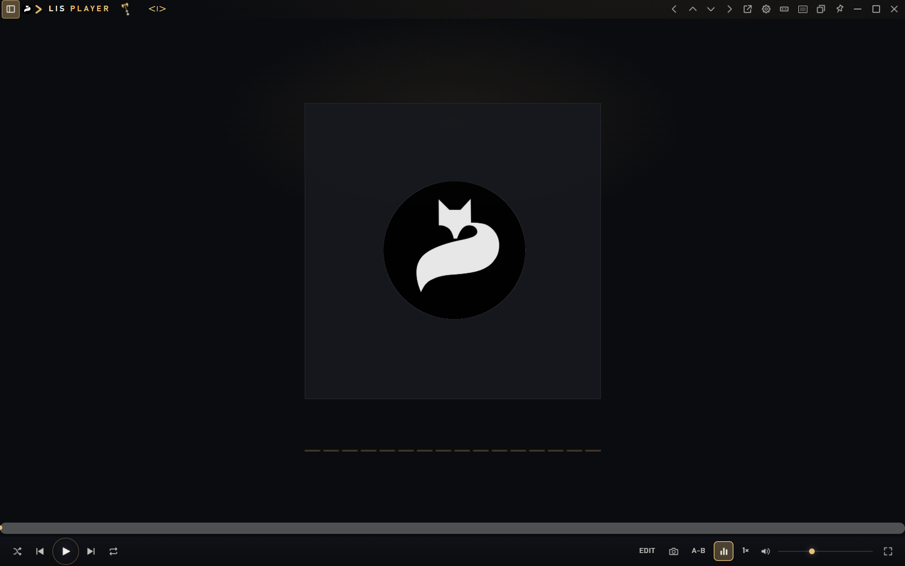

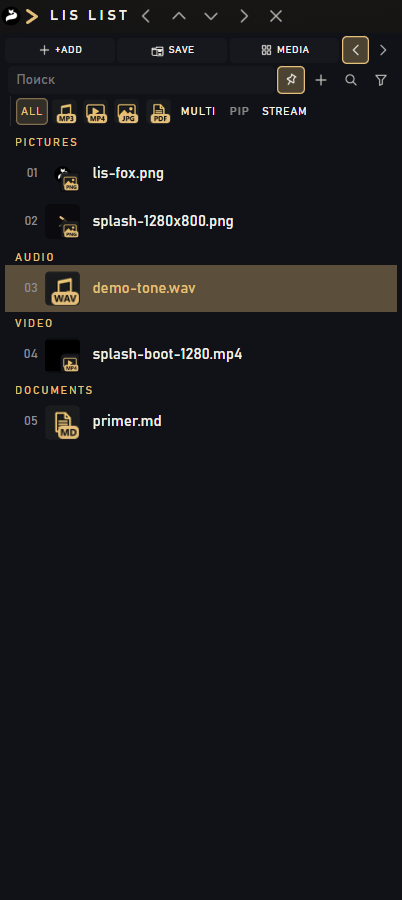

### Настройки

Шестерёнка. Тема, окно, подписи фото, воспроизведение, колесо, шкалы, столбцы, история, папки, клавиши, редакторы, дубликаты окон, ассоциации форматов, сброс.

### Компактный режим

Иконка мини-плеера. См. таблицу режимов.

### Окно как есть / окно следует за кадром

Кнопка с рамкой кадра. **Выкл (по умолчанию):** фото и видео вписываются в текущий размер окна, пропорции сохраняются. **Вкл:** при новом файле окно подгоняется под настоящий размер кадра. В компакте окно за файлом не прыгает — там только рамка и безрамный просмотр. Та же галочка есть в настройках: «Окно следует за кадром — под размер фото или видео».

### Без рамки

См. выше. Повторный клик возвращает классическую компоновку и может снова показать плейлист, если он был включён.

### Поверх окон / булавка шапки

- Свободное окно: «Поверх окон» — always-on-top.
- При магнитах: «Закрепить — не скрывать» — не прятать полосу, если кликнули по рабочему столу (связано с настройкой «Прятать примагниченное окно…»).

Не путать с **булавкой внутри плейлиста** (см. [Плейлист](#плейлист)).

### Свернуть / развернуть / закрыть

- **Свернуть** — в панель задач.
- **Развернуть** — снимает магнит и максимизирует.
- **Закрыть** — пауза и выход из программы.
- **Ctrl + крестик** — в трей **без** паузы.
- **Esc** — пауза и в трей (сначала закрывает листы, меню, рамку снимка, кисть, выделение в библиотеке).
- **Shift+Esc** — вернуть плеер с того же места, в том числе из другой программы.

---

## Плейлист

Показ и скрытие — **только** левая кнопка шапки.

### Шапка списка

| Кнопка | Что делает |
|---|---|
| **+Add** | Добавить файлы. **Shift+клик** — целую папку |
| **Save** | Сохранить текущий список как альбом в List Player Library |
| **Media** | Каталог библиотеки (полки / календарь) |
| **← / →** | Плейлист слева или справа от сцены |

### Инструменты списка

| Элемент | Действие |
|---|---|
| **Поиск** | Фильтр строк. Фокус: `F3` или `Ctrl+F` (сначала открывает плейлист) |
| **Булавка** | «Закрепить плейлист — закрыть только кнопкой панели». Снятая: «Открепить плейлист — можно спрятать к краю» |
| **+** (режим проводника) | Выкл: двойной щелчок в Проводнике **заменяет** очередь. Вкл: **добавляет** файл в открытый список |
| **Лупа** | Прокрутить к текущему треку |
| **Фильтр** | Убрать повторы (`Ctrl+D`) |

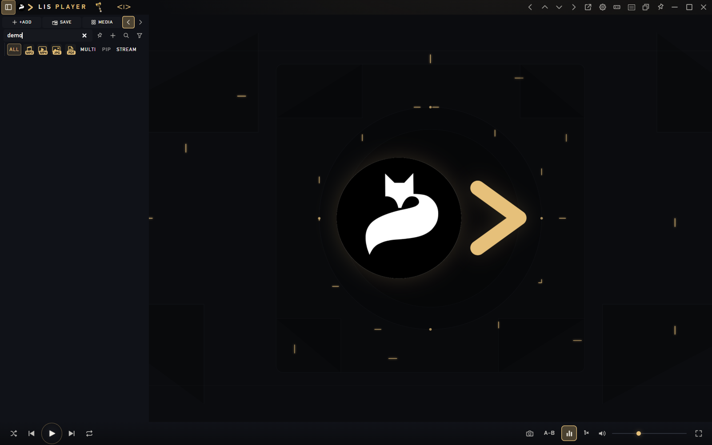

*Поле «Поиск» над фильтрами типа.*

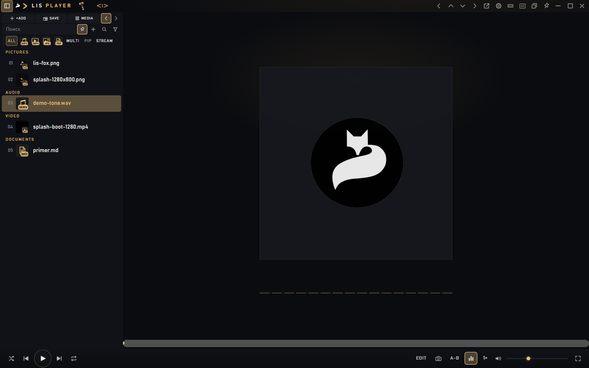

*Булавка подсвечена. Список сгруппирован по Pictures / Audio / Video / Documents.*

### Фильтры типа

- **ALL** — все типы, обычный плеер. Сбрасывает фильтр и **MULTI**.
- Иконки **Audio / Video / Pictures / Documents** — показать только этот род. Без MULTI смена типа ставит остальное на паузу.
- **MULTI** — категории играют вместе (например музыка под картинками). Появляется второй ползунок громкости «Музыка».
- **PIP** — слои поверх сцены, их можно перетащить. Включение PIP само включает MULTI. Выключение MULTI гасит PIP.
- **STREAM** — один файл открывает всю папку того же типа и играет подряд без остановки. Выкл: один файл, Play снова запускает его.

### Строка списка и меню

Перетаскивание строк меняет порядок. Правый щелчок:

- Играть
- Играть следующей
- В очередь
- **Убрать из списка / В корзину / Убрать копию** — текст зависит от цвета топора
- Переименовать
- Добавить все файлы папки (если есть)
- Восстановить из корзины (для серых пропавших)

**Delete** на выделенной строке плейлиста и **Delete**, пока на сцене открыт файл, вызывают то же удаление, что пункт меню: логика **топора** (только строка / в корзину / копия в библиотеке).

Столбцы (исполнитель, альбом…) включаются в настройках. Щелчок по ячейке открывает редактор тегов. Правый щелчок по шапке столбца → «Скрыть столбец».

Перетащите обложку «сейчас играет» в папку Проводника или мессенджер — уйдёт файл.

---

## Сцена и транспорт

### Нижняя панель (классика)

Слева — обложка и имя. По центру — время, полоса seek, длительность. Справа — дополнительные кнопки и громкость.

**Кнопки транспорта на сцене / внизу:**

| Кнопка | Клик | Ещё |
|---|---|---|
| **Перемешать** | вкл/выкл случайный порядок | скрыта на картинках |
| **Предыдущий** | прошлый файл; у аудио/видео если уже прошло > 3 с — в начало | удержать — листать подряд |
| **Играть / пауза** | старт и стоп | Пробел. На картинках — слайдшоу, на документе Пробел листает страницу |
| **Следующий** | следующий файл | удержать — листать |
| **Повтор** | клик: выкл → весь список → одна композиция | удержать 2 с: весь список; на фото кнопка скрыта |
| **A-B** | 1-й клик ставит A, 2-й — B, 3-й снимает | маркеры A и B на полосе можно тащить |
| **EQ** | эквалайзер | скрыт на картинках |
| **Скорость** | клик — следующая скорость | удержать 2 с — меню 0.5× … 2× |
| **Громкость** | mute | ползунок; в MULTI второй ползунок «Музыка» |
| **На весь экран** | кинозал для видео и фото | `F` |
| **Снимок** | кадр в `Images\Screenshots` | удержать — рамка обрезки. `Shift+S` |
| **EDIT** | открыть встроенный редактор (или выбранный .exe) | `Ctrl+E`. Состав панелей — в [EDIT и редакторы](#edit-и-редакторы) |

*Видео: полоса перемотки на сцене, play / shuffle / repeat, EDIT, снимок, A-B, EQ, скорость, громкость.*

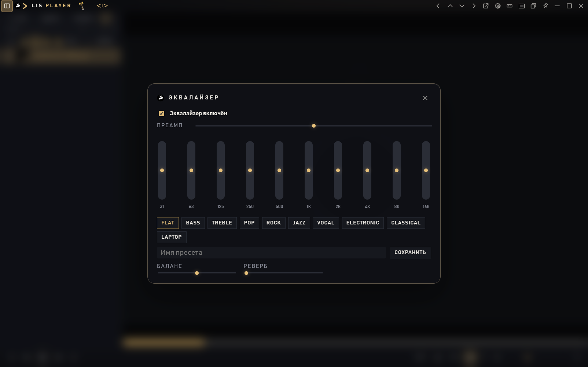

*Преамп, 10 полос, пресеты, баланс, реверб.*

### Шкалы на сцене

- **Громкость** — вертикальная/краевая рейка (сторона в настройках: авто / лево / право / верх / низ).
- **Яркость** — аналогично, можно скрыть.
- **Масштаб видео** — верхняя рейка. Колесо на шкале — зум; зажать и вести на кадр — как с Ctrl. Двойной щелчок по рейке сбрасывает.
- **Перемотка** на сцене — снизу или сверху. На видео при наведении — превью кадра.

Колесо на сцене: шаг перемотки / громкости / яркости задаётся в настройках (по умолчанию 0.02 с и 2%).

---

## Картинки: FIT, SLIDE, кисть

На фото **прячутся** shuffle, repeat, A-B, EQ, скорость и громкость. Prev/Next становятся перелистыванием, Play — слайдшоу.

Справа на нижней полосе — инструменты кадра. Слева направо:

| Кнопка | Что делает |
|---|---|
| **FIT** | вписать картинку в сцену |
| **1:1** | показать в натуральную величину |
| **SLIDE** | слайдшоу. Правый щелчок → «Мелодия»: музыка из плейлиста или отдельный файл |
| **EDIT** | открыть LIS Tone (или внешний редактор фото). Подробно ниже |
| **Снимок** (камера) | сохранить кадр в `Images\Screenshots`. Удержать — рамка обрезки. `Shift+S` |
| **Кисть** | рисовать поверх фото (и документов) |

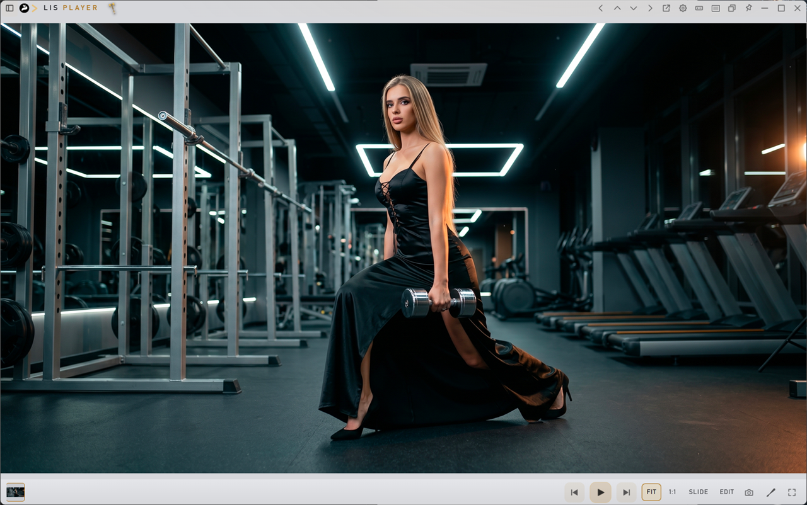

*Живое окно: FIT, 1:1, SLIDE, **EDIT**, камера и кисть справа внизу. Края кадра — зоны перелистывания.*

*Тот же набор на тёмной теме. Лента эскизов внизу, если плейлист свёрнут (или всегда — галочка в настройках).*

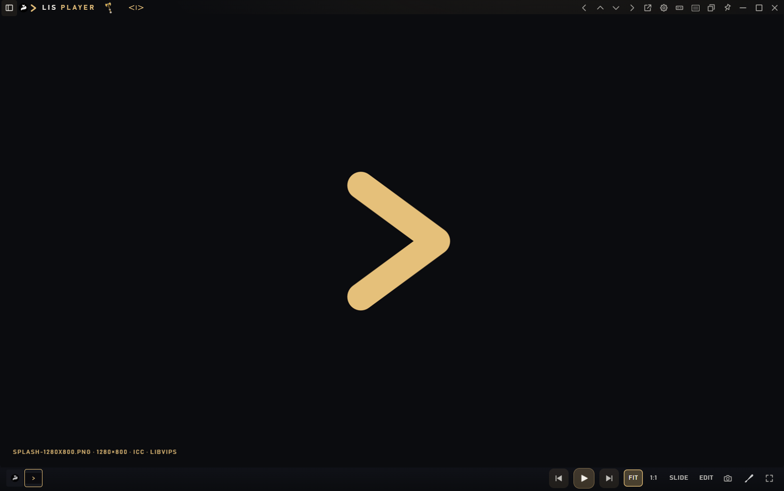

*Клик по эскизу открывает этот кадр. Подпись файла вспыхивает при смене и гаснет через 2,5 с; угол подписи выбирается в настройках.*

**Кисть** (на фото и в документе): короткий клик — рисовать выбранным инструментом. Удержать кнопку — меню: **Кисть**, **Маркер**, **Рамка**, **Стрелка**. Правая кнопка — толщина (2…36) и цвет (золото, белый, чёрный, красный). На сцене появляются «Шаг назад» и «Сохранить копию».

**Поворот на диске:** `Ctrl+←` / `Ctrl+→` — на 90°, `Ctrl+↑` / `Ctrl+↓` — на 180°. Файл переписывается. Перетащите картинку со сцены — уйдёт копия файла. `Ctrl+C` копирует кадр.

При **перелистывании** (края кадра, стрелки, лента) масштаб сбрасывается на FIT. В **кинозале** у фото те же краевые зоны со стрелками.

---

## EDIT и редакторы

**EDIT** на нижней полосе (и `Ctrl+E`) открывает встроенное окно LIS или программу, которую вы указали в Настройки → Редакторы. Кнопка есть у фото, видео, аудио и документов. Пока файл грузится, на сцене — «Загрузка…».

Галочка LIS и путь к .exe вместе не живут: если выбрать внешнюю программу, галочка снимается. Снять галочку без пути — файл из EDIT не откроется.

Внизу каждого встроенного окна четыре действия с результатом: **Сохранить копию**, **В библиотеку**, **Сохранить как…**, **Заменить файл**.

### LIS Tone — фото

Открывается с картинки. Слева — кадр (удержать, чтобы увидеть оригинал). Справа — инструменты.

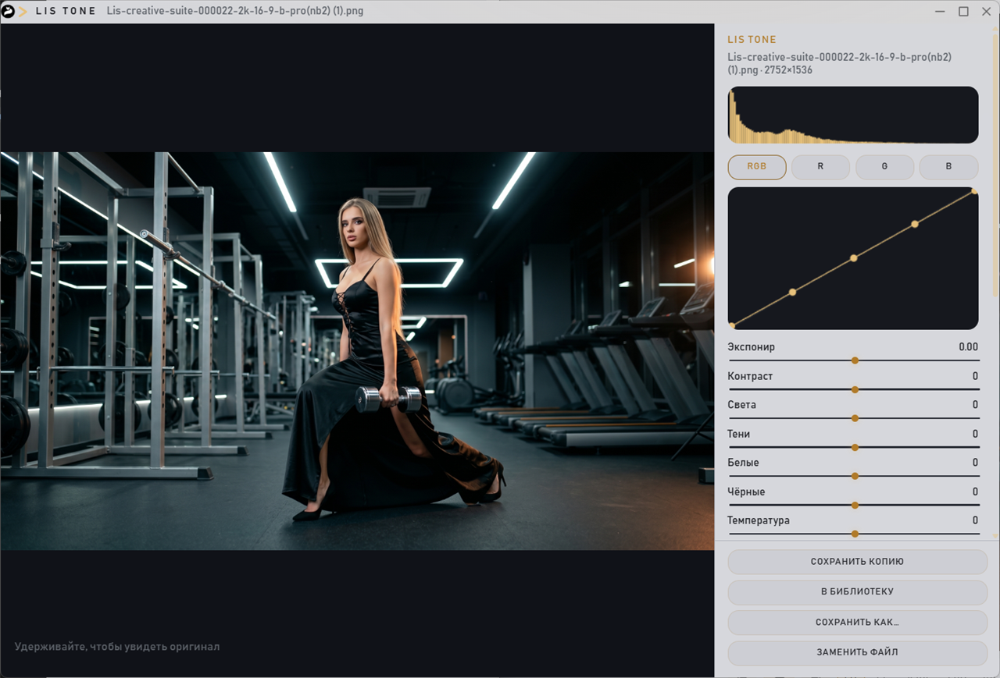

*Гистограмма, кривая RGB / R / G / B, экспонир, контраст, света, тени, белые, чёрные, температура.*

Дальше по панели (прокрутите правый столбец):

- **Тон, вибрация, насыщенность, виньетка, резкость, ясность**
- галочка **Чёрно-белое**
- блок **Кадр:** ползунки слева / справа / сверху / снизу
- **↺ 90°**, **↻ 90°**, **⇄** (отражение)
- **Автоконтраст**, **Сброс**
- формат сохранения: JPEG, PNG, WebP, TIFF (для GIF ещё MP4)

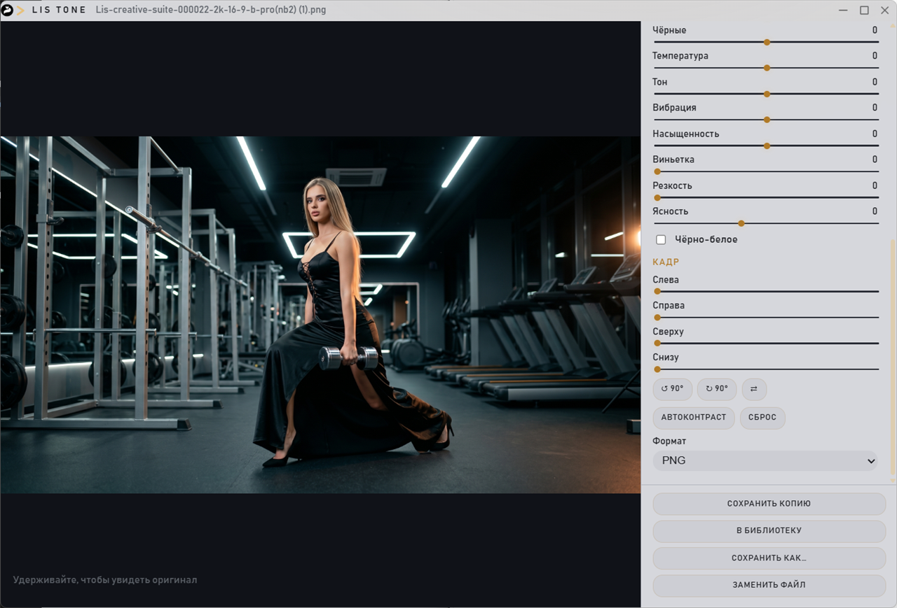

*Нижняя часть той же панели: обрезка краёв, поворот, отражение, автоконтраст и формат.*

Это не кисть и не рамка снимка: кисть и камера остаются в окне плеера.

### LIS Grade — видео

С видео EDIT открывает LIS Grade. На сцене — кадр и шкала. Справа:

- **Обрезка:** «Начало здесь» / «Конец здесь», ползунки «Обрезать с» / «Обрезать до». Подсказка в окне: перемотайте шкалой, остановите и зафиксируйте рез.
- **Цвет:** экспонир, контраст, насыщенность, оттенок, температура, тон
- **Кино:** клик по катушке — последний лут; удержать 3 с — ясность, резкость и пресеты Кино / Ночь / Плёнка / Ч/Б / Свой
- **Текст и субтитры:** строка на кадре, шрифт, размер, цвет, обводка, положение, время «с / до», «Добавить строку»
- **Звук:** как есть / без звука / заменить файлом; громкость; извлечь WAV; удалить звук
- **Качество:** MP4 / WebM / GIF, сжатие, кодек; «Сжать рядом», «Сделать GIF», «Кадры PNG»
- **Сброс цвета**

### LIS Cutter — аудио

С аудио: волна слева, справа LIS Cutter.

- Слушать / стоп
- **Начало** и **Конец** фрагмента
- **Оставить** только выделенное или **Вырезать** его из файла
- появление и затухание
- низ обрезать, верх обрезать, присутствие, реверберация
- «Улучшить (компрессор + ясность)», «Нормализовать пик»
- формат MP3 / WAV / OGG, **Сброс правок**

### LIS Docs — документ

С текста, JSON, Markdown и других документов из Formats.

- **Текст** / **Просмотр**
- **Format JSON**
- перенос строк

PDF в этом окне открывается для просмотра; правка — у текстовых файлов.

---

## Просмотр файлов

### Аудио

Обложка по центру, визуализатор, полная звуковая панель.

*Если окно примагничено вверх или вниз, раскладка становится ещё более «аудио-полосой».*

### Видео

Кадр, перемотка с превью, яркость, зум, лупа при зажатом Ctrl, A-B, EQ, скорость. Запятая / точка — кадр назад / вперёд. Двойной щелчок по зрителю — **кинозал**, не плейлист.

### Документы

Markdown, PDF, TXT, JSON, HTML, CSV и другие, которые назначены в Formats.

*Кнопки − / 100% / + / ШИР, ползунок страниц, кисть. `PageUp` / `PageDown` — страницы. Пробел — следующая страница. Ctrl + колесо — масштаб. `Alt+←/→` — история сессий (в режиме документа стрелки истории показываются сами, если есть куда вернуться).*

### Двойной щелчок по зрителю

| Что на сцене | Двойной щелчок |
|---|---|
| Видео или фото | Кинозал |
| Компакт | Выйти из компакта |
| Иначе | Развернуть окно |
| Шапка | Компакт |

Одиночный щелчок по видео — пауза/игра. По фото и документу одиночный щелчок воспроизведение не переключает (чтобы не мешать листанию и прокрутке).

---

## Работа с файлами

Топор решает, **трогает ли плеер файлы на диске**. Открывается удержанием иконки **2 секунды**.

Подписи в листе — как в программе:

| Кнопка в UI | Цвет | Delete и «убрать» в плейлисте | Новые файлы в очередь | Перетаскивание **в открытую папку библиотеки** |
|---|---|---|---|---|
| **Оранжевый · не трогать файлы** | оранжевый | только строка списка, без корзины и копий | как есть | **копия** |
| **Красный · в корзину** | красный | файл **в корзину Windows** вместе с исходником | как есть | **перемещение** |
| **Зелёный · копия в библиотеку** | зелёный | если файл уже в библиотеке — в корзину **копию**; исходник снаружи не трогаем | при открытии **копируется** в List Player Library | **копия** |

Текст-пояснение в листе (цитаты из программы):

- Оранжевый: «файлы на диске не трогаем. Delete и „Убрать из списка“ снимают только строку плейлиста, без корзины и копий.»
- Красный: «Delete, удаление из списка и „В корзину“ сразу отправляют файл в корзину Windows вместе с исходником. Вернуть можно из корзины.»
- Зелёный: «при открытии файл копируется в папку библиотеки, исходник не трогаем. Удаление из списка убирает только копию в библиотеке.»

Пункты меню плейлиста при этом называются: «Убрать из списка» / «В корзину» / «Убрать копию».

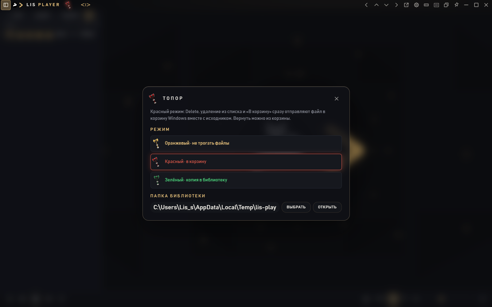

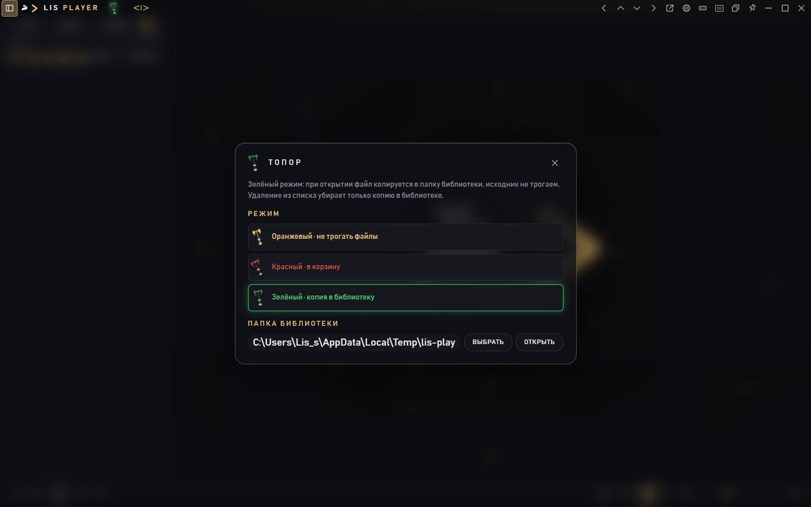

Отдельно в настройках папок есть галочка **«Перманентные действия в плейлисте — перемещать файлы в библиотеку, а не копировать»**. Она относится к **Save** (сохранение альбома), не подменяет цвет топора при drag-and-drop в каталог.

Переключение на зелёный, если в очереди уже есть файлы, сразу запускает копирование очереди в библиотеку.

---

## Библиотека

Кнопка **Media**. Каталог **List Player Library**: папки Audio, Video, Images, Documents. Скриншоты — `Images\Screenshots`. Старая «List Library» не трогается.

*Четыре полки и альбомы (в том числе «Демо», «Screenshots», «Корень» для файлов без подпапки).*

*Группировка по месяцам съёмки/записи.*

*Крошки «← Полки / Images», вложенные альбомы. Клик по папке входит внутрь.*

**На диске** — открыть папку библиотеки в Проводнике. Поиск «Найти в библиотеке» фильтрует имена.

### Выделение и файловые операции

- **Удержать карточку 1,5 с** — режим галочек. Появляется панель: число, Копировать, Переместить, Удалить, Готово.
- **Shift** — диапазон от последней отметки.
- **Delete** в библиотеке — **всегда в корзину Windows** (цвет топора на это не влияет).
- Правый щелчок: **Переместить** / **Копировать** / **Удалить**.
- Перетаскивание **из** библиотеки наружу — **копия** (нативный drag).
- Перетаскивание **в** открытую папку библиотеки или на карточку альбома — **копия или перемещение по цвету топора** (см. таблицу). Если вы на полках и папка не открыта, всплывает «Откройте папку, чтобы положить файлы».

Удаление из библиотеки убирает файл и из очереди, если он там играл.

---

## Настройки

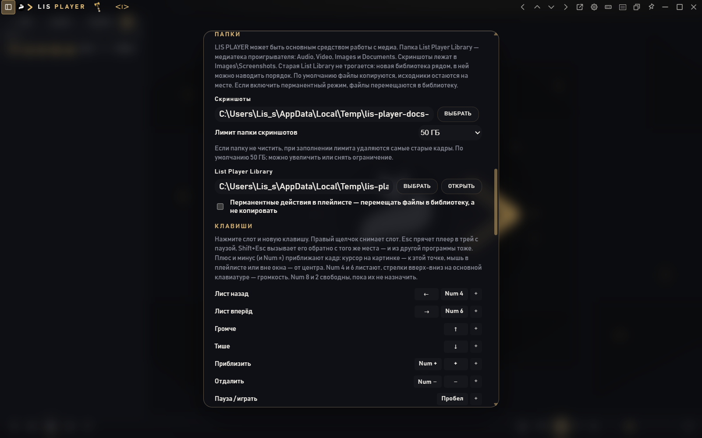

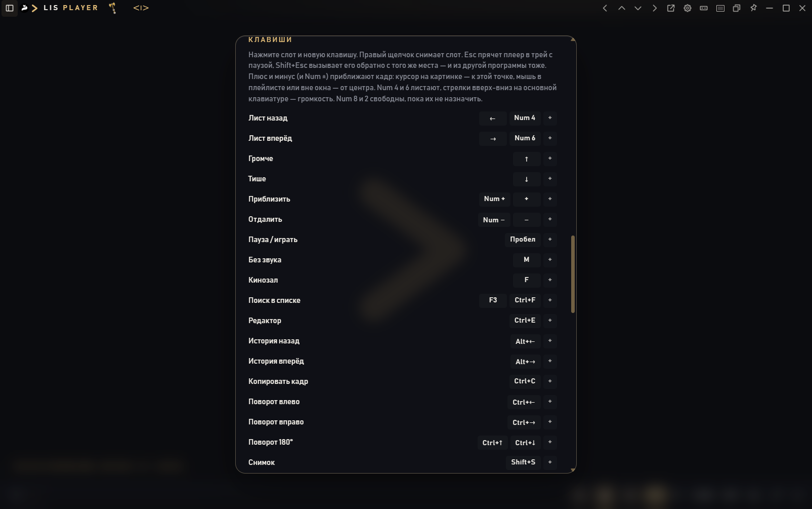

Кратко по блокам (как в листе настроек):

- **Тема:** Fox · золото, Cinema · красный, Night · синий, Snow · белая, Mist · серая. По умолчанию Mist; выбранная тема запоминается.
- **Окно и плейлист:** посадка кадра (см. кнопку рамки). **Анимация открытия** — как кадр появляется, когда файл открывается в окно: Выкл, Тихая (по умолчанию), Обычная, Яркая. Перелистывание стрелками, колесом и лентой идёт сразу, без эффекта.
- **Pictures:** подпись (при смене и по наведению / всегда), угол, «Лента эскизов всегда — и в безрамочном режиме».
- **Прятать примагниченное окно, если щёлкнуть по рабочему столу.**
- **Воспроизведение:** помнить позицию; двойной щелчок в Проводнике добавляет в список; остановиться после текущего; таймер сна 15–120 мин.
- **Шаг колеса** и **сторона шкал**.
- **Столбцы списка.**
- **История сессий:** всегда показывать стрелку; сколько откатов хранить (3…20 или «Все», до 80 сессий).
- **Папки:** скриншоты и List Player Library, лимит папки скриншотов (по умолчанию 50 ГБ — старые кадры удаляются).
- **Клавиши:** слот + новая клавиша; правый щелчок снимает слот; «Сбросить клавиши».
- **Редакторы:** галочки LIS Tone / Grade / Cutter / Docs или путь к .exe. Подробно в [EDIT и редакторы](#edit-и-редакторы). Галочка и внешняя программа вместе не живут.
- **Дубликаты окон:** по умолчанию плеер один; можно открывать второе окно на каждый файл выбранных типов/расширений.
- **Formats:** ассоциации Windows по Video / Pictures / Audio / Documents.
- **Сброс** — заводские тема, окно, плейлист, эквалайзер и пути; плейлист снова свёрнут.

---

## Клавиатура

Заводские (их можно сменить в настройках):

| Действие | Клавиши |
|---|---|
| Лист назад / вперёд | `←` `→`, Num 4 / Num 6 |
| Громче / тише | `↑` `↓` |
| Приблизить / отдалить | `+` `−`, Num ± |
| Пауза / играть | Пробел |
| Без звука | `M` |
| Кинозал | `F` |
| Поиск в списке | `F3`, `Ctrl+F` |
| Редактор | `Ctrl+E` |
| История назад / вперёд | `Alt+←` `Alt+→` |
| Копировать кадр | `Ctrl+C` |
| Поворот | `Ctrl+←` `Ctrl+→` `Ctrl+↑` `Ctrl+↓` |
| Снимок | `Shift+S` |
| В трей с паузой / выход | `Esc`, ещё `Ctrl+Q` |
| Вернуть из трея | `Shift+Esc` |

Плюс и минус: курсор на картинке — зум к этой точке; мышь в плейлисте или вне окна — от центра. Num 8 и 2 свободны, пока их не назначить.

Дополнительно (не из таблицы слотов): `Delete` в библиотеке, на строке списка и на открытом в зрителе файле (топор); `Ctrl+D` дубликаты; `,` и `.` — кадр назад / вперёд; `[` / `]` — точки A и B, `\\` снимает A-B; `Q` — в конец очереди, `Shift+Q` — играть следующей; `Ctrl+Shift+стрелки` — примагнитить к краю.

---

## Режимы окна

### Кинозал

Отдельное чёрное полноэкранное окно для **видео и фото**. Плейлист при открытии прячется. Воспроизведение в основном окне ставится на паузу и продолжается после выхода.

*Двойной щелчок по зрителю или кнопка полного экрана. Это не разворот плейлиста. У фото по краям — те же стрелки перелистывания; при смене кадра масштаб сбрасывается.*

### Примагничивание

Стрелки шапки. Настройка автоскрытия при клике по столу. Пока магнит включён, выход крестиком/Esc чаще сворачивает к краю, чем закрывает процесс.

### Трей

Esc / Ctrl+крестик. Клики по значку в трее: один — play/pause, два — показать окно. Глобальный **Shift+Esc** поднимает плеер.

### Редакторы

`Ctrl+E` или кнопка **EDIT** на нижней полосе. Встроенные окна: LIS Tone (фото), LIS Grade (видео), LIS Cutter (аудио), LIS Docs (текст). Либо выбранная внешняя программа. Состав панелей — в [EDIT и редакторы](#edit-и-редакторы).

### Обложка и теги

Клик по обложке на сцене или в «сейчас играет». Перед записью тегов показывается предупреждение об авторском праве (ГК РФ). Можно записать в исходник или сохранить копию рядом с пометкой «копия».

---

## Что на этих скриншотах не показано

Снято с живого окна проекта. Не снимались (нужно действие руками или личные файлы):

- галочки библиотеки после удержания 1,5 с и диапазон Shift;
- сам жест перетаскивания в папку библиотеки;
- MULTI + PIP со слоями поверх кадра;
- слайдшоу с мелодией;
- примагничивание **вверх**;
- восстановление из корзины;
- окна LIS Grade (видео), LIS Cutter (аудио) и LIS Docs — панели описаны по живым подписям в программе; сняты LIS Tone и полоса EDIT.

Кинозал на снимке — кадр демо-ролика заставки, без наведения на шкалы кинозала.
